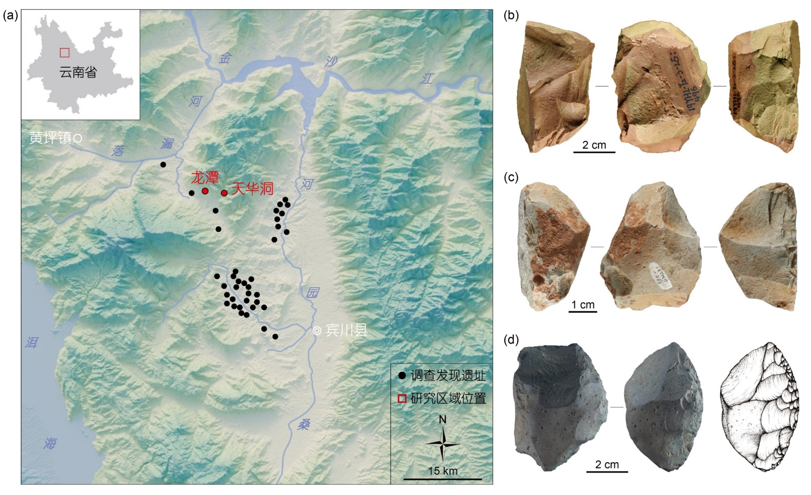
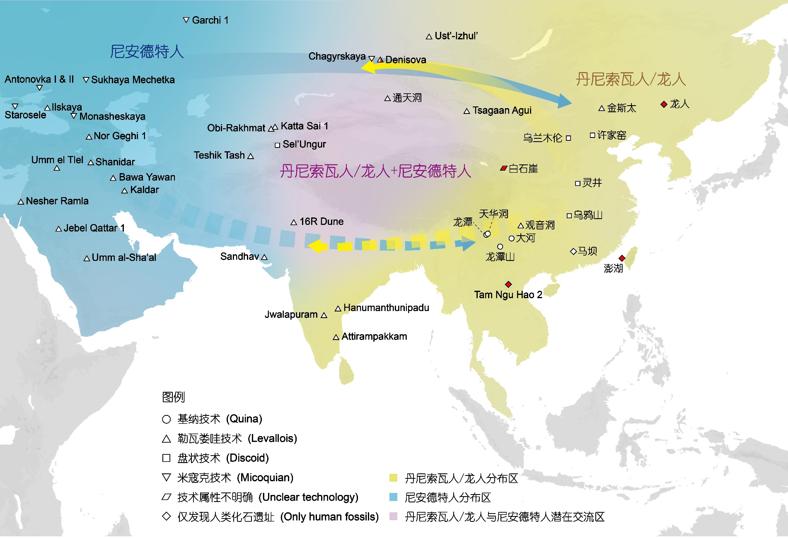

# 示例文章：云南旧石器中期基纳技术的发现与中国尼安德特人问题讨论

肖培源^1,2^，阮齐军^3^，贾真秀^1^，夏欢^4^，张东菊^4^，李浩^1,2*^，陈发虎^1,2,4*^

1. 中国科学院青藏高原研究所古生态与人类适应团队，青藏高原地球系统与资源环境全国重点实验室，北京 100101
2. 中国科学院大学，北京 100049
3. 云南省文物考古研究所，昆明 650118
4. 兰州大学资源环境学院，西部环境教育部重点实验室，寒区旱区生物考古国家文物局重点科研基地，兰州 730000

*联系人，E-mail: lihao@itpcas.ac.cn; fhchen@itpcas.ac.cn*

国家自然科学基金（42471180）资助

## 摘要

距今约30-4万年的旧石器时代中期，以多种古人类（尼安德特人、丹尼索瓦人、早期现代人等）的共存和多样化的石器技术为特征。传统观点认为东亚地区石器技术发展缓慢，尤其是缺少旧石器时代中期技术类型。然而，近年来的研究不断揭示出该区域古人类演化和石器技术发展的复杂性，特别是以勒瓦娄哇技术、盘状技术为特色的旧石器中期石制品组合的发现，为重新审视东亚地区石器技术的发展与演化轨迹提供了关键证据。本文对东亚地区首次识别出的旧石器时代中期基纳技术体系进行系统介绍，并探讨其在认识欧亚大陆东部尼安德特人、丹尼索瓦人等古老型人群时空分布和交流互动中的潜在意义。基纳技术的发现，进一步证实了东亚旧石器中期技术、文化以及人群的多样性与复杂性，突显了东亚地区在全球人类演化进程中的重要意义。

**关键词：** 旧石器时代中期；东亚地区；尼安德特人；丹尼索瓦人；基纳技术

## 引言

旧石器时代中期（Middle Paleolithic；距今约30~4万年）是人类演化历程中承上启下的关键阶段。这一时期不仅见证了早期现代人、尼安德特人（尼人）和丹尼索瓦人（丹人）等人群的演化，还记录了不同人群之间的复杂交流互动历史[1]。在非洲，石器时代中期（Middle Stone Age；相当于欧亚大陆的旧石器时代中期）与早期现代人的出现紧密相关，这一时期在石器技术上产生革新，并出现了一系列象征性行为[2]。而在欧亚大陆中西部地区，旧石器时代中期则与尼人的技术与行为紧密相关，且在石器技术上展现出显著的多样性，出现勒瓦娄哇、层状石叶、基纳、盘状-锯齿刃器等多种类型的旧石器中期技术体系，其中基纳技术是该技术体系中的一种重要类型。这些不同技术类型指示了尼人应对气候环境变化的灵活技术响应策略[3]。

在东亚地区，旧石器时代中期的古人类演化同样呈现显著的复杂性。以往研究表明，自距今约30万年以来，中国境内可能存在多种古人类群体，这些群体从化石形态上可大致分为四类：1）以大荔人为代表的中更新世晚期共有特征群体；2）以澎湖人和夏河人为代表的原始特征群体；3）以丁村人为代表的现代特征群体；4）具有独特形态组合的群体，这类群体以许昌人和许家窑人为代表，最新研究将其归为巨颅人（*Homo juluensis*）[4,5]。此外，甘肃白石崖溶洞夏河人的化石形态和古蛋白分析显示，该人群属于丹人[6~8]；而澎湖人的新近古蛋白证据也将其归为丹人[9]。同时，基于对旧大陆不同时期古人类化石表型特征开展的系统发育分析，确立了龙人（*Homo longi*）这一新的化石人种[10]，而最新古蛋白和古DNA分析证实其属于早期丹人支系[11,12]。这些研究结果共同揭示了中国旧石器时代中期人群构成的多样性和复杂性。但与这一现象形成鲜明对比的是，学术界普遍认为中国境内的石器技术发展缓慢，以简单的石核-石片组合和砾石石器组合为主，缺乏旧石器时代中期技术因素[13]，由此导致基于人类化石和基因的研究结果与考古证据呈现差异和矛盾。

然而，近年来的一些考古发现和研究成果，为重新审视中国旧石器时代中期阶段人类技术与行为演化提供了重要证据。例如，在新疆通天洞遗址（约5万年）和内蒙古金斯太遗址（约4.5~3.7万年）发现了典型的旧石器中期勒瓦娄哇技术产品，可能指示尼人的东扩[14,15]；在河南灵井许昌人遗址（约12.5~10万年）发现盘状石核、以锯齿刃器为代表的多样化中小型石片工具，以及骨角工具，代表了以盘状技术为特色的旧石器中期技术类型[16]；在贵州观音洞遗址发现了以勒瓦娄哇技术为主的旧石器中期石制品组合，并将东亚勒瓦娄哇技术出现的时间提早至距今约17~8万年[17]，但也有学者对观音洞遗址石制品的技术属性提出质疑[18]。总体来看，上述发现显示中国境内不仅存在旧石器中期技术，且在类型上具有明显的多样性与复杂性，这为理解东亚地区古人类的技术演化、不同人群之间的扩散交流，以及识别更多新的技术类型等提供了重要线索[19]。

## 云南基纳型旧石器中期技术

基纳技术是欧洲旧石器时代中期最具代表性的技术类型之一，集中出现在深海氧同位素（MIS）4~3阶段，被认为是尼人应对干冷环境的一种特殊适应策略[20]。其核心技术特征主要体现在三个方面：1) 采用平面-斜割策略剥取侧边保留石皮且横截面不对称的厚石片，作为后续制作基纳刮削器的毛坯；2) 软锤与硬锤并用进行工具刃缘的修理，依次产生凸型和凹型修疤；3) 通过不断地更新和维护刃缘，以达到延长基纳刮削器使用时间的目的；4) 更新刃缘过程中产生的再修理石片可作为毛坯，进一步制作小型工具，体现出基纳技术的多层级分支化概念和策略[20]。总体而言，基纳技术的剥坯方式和修理技术具备固定的概念版型和操作程式，生产出的工具（即基纳刮削器）的形态相对规整且能够循环使用，充分体现了以高流动性为特征的狩猎经济策略[20]。

基纳技术目前集中发现于西欧和南欧地区，临近地中海东岸的西亚地区也有少量发现，但是东亚地区在之前并未有明确的发现和报道。近年来，来自滇西北地区的发现，为重新认识基纳技术在欧亚大陆的时空分布提供了全新证据。滇西北地区位于青藏高原东南部，是世界上生物多样性研究的热点区域。自2010年以来，在该地区集中调查发现了30余处含基纳石制品组合的遗址（图1(a)）[21]。其中，龙潭遗址是迄今唯一经过正式发掘的遗址[22]，共包含4个地层单元，其中第3层为原生文化层，光释光测年显示该层年代为距今约6~5万年。孢粉分析表明，龙潭古人类生活在相对开阔的森林-草原镶嵌环境中[20]。

通过对龙潭遗址文化层出土的3487件石制品开展系统定量技术分析，研究者识别并重建了该遗址完整的基纳技术操作序列。在剥坯环节，龙潭遗址的基纳石核普遍具有两个及以上的剥坯面，各剥坯面之间呈现平面-斜割结构；基纳石片的侧边常保留石皮，其横截面呈不对称形态，并且厚度显著大于遗址组合中其他类型的石片。在修理环节，基纳技术体系中最具特色的基纳刮削器均存在两层及以上的修疤，其中最内层修疤以凸型为主，而靠近刃缘的外层修疤则多呈凹型（图1(b-d)）。基纳刮削器的加工程度显著高于其他类型工具，表明其具有较长的使用周期。遗址中部分小型工具以再修理石片为毛坯，这种现象体现了多层级分支化的技术策略。整体来看，龙潭遗址的上述特征与欧洲基纳石制品组合表现出高度的一致性。对基纳刮削器进行的微痕分析显示，这些工具用来加工处理骨头、木头、兽皮等不同对象，具有多功能性[20]。

{#fig-quina-sites width=90%}

**图1**（网络版彩色）滇西北地区基纳遗址分布及基纳刮削器标本展示。(a) 鹤庆黄坪盆地和宾川盆地基纳遗址分布。(b) 龙潭遗址文化层出土的基纳刮削器。(c) 天华洞遗址采集的基纳刮削器。(d) 宾川盆地采集的基纳刮削器。

**Figure 1** Distribution of Quina sites in northwest Yunnan and examples of Quina scrapers. (a) Locations of Quina sites in the Heqing Huangping and Binchuan basins. (b) Quina scraper discovered in situ at the Longtan site. (c) Quina scraper from surface collection at the Tianhuadong Cave site. (d) Quina scraper from the surface collection in the Binchuan basin.

实际上，基纳技术在中国其他地区曾有零星报道。如在北方地区，内蒙古赤峰三龙洞遗址（约5万年）报道了具有基纳修理特征的石制品[23]。在云南昆明白石岭遗址[24]和龙潭山第2地点（约3万年）[25]，发现少量带有层叠修疤的刮削器，被认为具有欧洲莫斯特文化的技术风格。另外，在云南曲靖富源大河遗址也报道了具有莫斯特技术特征的石制品组合，其中的半月形器展现出基纳修理特征，年代可能早于4万年[26]。上述发现为在更大范围识别基纳技术提供了重要线索。但是，目前关于这些遗址石制品的技术特征、技术属性，及其年代信息等，均缺乏明确的认识。

总体而言，滇西北地区大量集中分布的基纳遗址的发现，以及对其中的龙潭遗址的发掘和研究，进一步更新和丰富了对中国旧石器中期技术多样性和复杂性的认识。此外，由于基纳技术在欧洲与尼人密切相关[20]，龙潭遗址的发现和研究也为理解尼人在东亚的潜在分布模式及其与本土人群的交流等提供了全新视角。

## 东亚是否存在尼人及其潜在时空分布

尼人是否扩散至东亚地区，是国内外学术界长期关注的热点问题。古人类化石的研究显示，华南地区的马坝人（约30~13万年）厚而圆的眶上缘、发育程度较高的额窦等均与欧洲尼人相似[27]；中原地区的许昌人（约12.5~10.5万年）和华北地区的许家窑人（约20~16万年）拥有巨大的颅容量，其内耳迷路形态也都展现出与尼人较高的相似性[4]。此外，云南昆明的龙潭山第2地点（约3万年）出土了一枚具有卵圆形齿冠轮廓的臼齿化石，其形态特征与欧洲尼人更为接近[25]。上述人类化石展现出的与尼人相近的形态特征，很可能暗示了尼人的扩散和分布范围已进入东亚腹地，并可能与东亚本土古老型人群（如丹人）之间存在一定程度的基因交流。

从现有的考古学证据来看，内蒙古金斯太遗址（约4.5~3.7万年）发现了特征明确的勒瓦娄哇技术产品，被视为尼人沿北方草原东扩的重要证据[13]。同时，新疆北部阿尔泰地区的通天洞遗址（约5万年）也发现了典型的旧石器中期勒瓦娄哇技术产品，暗示尼人曾扩散至中国西北地区[14]。位于中国西南的贵州观音洞遗址同样发现了勒瓦娄哇技术产品（约17~8万年），研究者认为其可能与尼人存在关联[17]。位于华北地区的许家窑人遗址和灵井许昌人遗址出土了以盘状技术和中小型石片工具为特色的旧石器中期石制品组合，两个遗址人类化石均表现出部分尼人的形态特征[4]。此外，在云南昆明的龙潭山第2地点（约3万年），识别出具有欧洲莫斯特技术风格的石制品，同时出土有与尼人形态特征相似的臼齿化石[25]。龙潭遗址性质明确的基纳技术体系的发现，为进一步探讨尼人在东亚地区的出现及其潜在分布模式提供了新的重要线索。

基于目前的证据，尼人在东亚地区的扩散可能存在以下路线：1) 北方草原路线。尼人首先到达西伯利亚地区，如在丹尼索瓦洞发现尼人和丹人基因交流的证据[28]，之后进入中国北部边疆地带（如新疆、内蒙古等地区），部分群体可能南下到达中原地区，乃至中国西南地区（图2）；2) 自南亚扩散至中国西南地区的路线（图2），印度次大陆发现的旧石器中期技术（如Attirampakkam遗址，距今约30万年[29]）在一定程度上指示了该路线的可能性。然而，东亚地区目前与尼人相关的文化遗存和化石证据较少，限制了对该问题的进一步探讨。

{#fig-dispersal-routes width=90%}

**图2**（网络版彩色）欧亚大陆中东部旧石器时代中期重要遗址分布及初步重建的人群扩散交流示意图。图中菱形标识代表仅发现人类化石的遗址，其余形状图标则对应不同的石器技术类型。其中，红色图标标注出土丹人/龙人化石的遗址；由于丹尼索瓦洞同时存在丹人/龙人和尼人化石，因此该遗址图标采用半填充红色表示。黄色箭头代表丹人/龙人向西的迁徙扩散，蓝色箭头代表尼人向东的迁徙扩散，其中虚线箭头代表推测的迁徙路线。

**Figure 2** Distribution of key Middle Paleolithic sites in Central and Eastern Eurasia and a preliminary reconstruction of hominin dispersal and interaction. Diamond-shaped symbols indicate sites where only hominin fossils have been discovered, while other shapes represent different lithic technology. Red-filled symbols mark sites yielding Denisovan/*Homo longi* fossils. The symbol for Denisova Cave is half-filled in red, signifying the co-occurrence of both Denisovan/*Homo longi* and Neanderthal fossils. The yellow arrows indicate the westward dispersal of Denisovans/*Homo longi*, while the blue arrows represent the eastward dispersal of Neanderthals; dashed arrows denote hypothesized migration routes.

## 讨论与展望

中国境内尼人线索的发现，为探讨丹人与尼人在东亚地区的复杂交流历史提供了新的视角。古蛋白分析和年代学研究表明，位于中国西北的甘肃白石崖溶洞曾长期被丹人占据，存在时间从距今22.4万年持续至距今3.2万年[6~8]；在台湾海峡发现的澎湖人也被归入丹人谱系，其可能年代范围为7~1万年或19~13万年[9]；位于东南亚的老挝Tam Ngu Hao 2遗址，发现了与丹人高度相似的臼齿化石，年代距今约16.4~13.1万年[30]；发现于黑龙江哈尔滨的龙人（*Homo longi*）头骨在表型特征上与夏河丹人构成相同支系，且分子证据表明其属于早期丹人，年代不晚于距今约14.6万年。从现生人群基因组的研究证据来看，大洋洲人群携带最高比例的丹人基因（约5%），该成分在欧亚大陆自东向西呈梯度递减趋势[31]。这种梯度模式可能指示丹人在东亚长期演化后，出现自东向西扩散的过程。位于西伯利亚阿尔泰地区的丹尼索瓦洞遗址，为丹人与尼人之间发生基因交流提供了明确证据[28]。龙潭遗址基纳技术的发现，可能进一步暗示了尼人与广泛生活在东亚地区的丹人，在中国西南地区产生了交流。

在丹人和尼人之外，东亚旧石器时代中期阶段是否存在早期现代人，也是学术界关注的核心问题。目前，东亚早期现代人的起源与演化线索仍较为模糊。在距今约30~13万年的中更新世晚期，丁村、盘县大洞和华龙洞遗址的人类化石呈现出部分早期现代人的体质特征[4]。此外，在距今约13~5万年，智人洞、福岩洞、陆那洞[32]等遗址均发现了具有现代人特征的化石。但是，目前对上述人类化石的分类地位、埋藏地层、年代等仍存在较大争议[10,32]，且由于部分人类化石缺乏伴生的文化遗存，制约了对其技术特征和文化面貌的认识。

从已有证据来看，旧石器时代中期的东亚地区，不仅在石器技术上表现出显著的多样性和复杂性，更展现出复杂多元的人类演化图景。云南基纳技术的发现进一步证实了东亚旧石器中期技术的复杂性，并为探讨古老型人类，尤其是尼人群体的演化扩散提供新视野。然而，龙潭遗址因缺乏人类化石材料，无法提供关于古人类扩散方面的直接证据；同时，基纳技术体系的东西方传播路径仍存在较大地理空缺。本文提出的上述假设旨在为思考尼人在东亚地区潜在的迁徙扩散提供新的视角。

总之，晚更新世以来的东亚地区并非简单的人群替代与灭绝的边缘地带，而是一个多线演化、复杂交织的核心区域。这一复杂演化格局包括了丹人的长期发展与潜在西扩、以手斧技术为特色的古老人群的连续演化、尼人的技术传播与渗透，以及可能的早期现代人的出现。未来应加强重点地区的考古调查和发掘工作，注重多学科合作研究和新技术新方法的应用，探讨石器技术与人群的耦合关系，解析不同人群之间的交流和互动过程，进而真正理解和认识中国，乃至东亚地区的古人类演化进程及其在全球人类演化历史中的独特作用和地位。

## English summary

**Middle Paleolithic Quina technology in Yunnan and the discussion of Neanderthals in China**

The Middle Paleolithic in Eurasia, also known as the Middle Stone Age in Africa, spans approximately 300 to 40 ka. This period represents a critical phase in human evolution, marked by the emergence of early modern humans, the diversification of archaic populations (e.g., Neanderthals and Denisovans), and significant innovations in lithic technology. In western Eurasia, Middle Paleolithic technologies exhibit remarkable diversity, exemplified by the Mousterian techno-complex associated with Neanderthals, which encompasses distinct variants such as Levallois, laminar, Quina, and discoid-denticulate systems. Meanwhile, human evolution in East Asia during this period was marked by considerable complexity, as reflected in a variety of archaic human fossils exhibiting mosaic anatomical features.

A newly conducted multidisciplinary study at the Longtan site (optically stimulated luminescence dating, approximately 60~50 ka) in northwestern Yunnan has identified, for the first time in East Asia, a well-defined Middle Paleolithic Quina techno-complex. This lithic technology is distinguished by a plan-secant flaking strategy, sequential edge retouching using both soft and hard hammers, and sustained edge resharpening to maintain functionality. This highly structured reduction system corresponds to technological patterns previously attributed primarily to Neanderthals in western Eurasia during MIS 4 to MIS 3 climatic oscillations.

By integrating multi-proxy evidence from fossil morphology, ancient genomics, and lithic technology, we propose that Neanderthals likely inhabited East Asia, potentially dispersing into the region via a northern steppe corridor through Siberia and a southern route via the Indian subcontinent. Overall, the discovery of Quina technology at Longtan not only fills a critical gap in Middle Paleolithic lithic technologies in East Asia, but also reinforces the diversity and complexity of lithic technology, cultural adaptations, and human populations in this region.

**Keywords:** Middle Paleolithic; East Asia; Neanderthals; Denisovans; Quina technology

## References as imported from Word

This example keeps the Word manuscript's numbered references as a migration aid. For a final thesis, convert these records into BibTeX entries in `thesis/Biblio/ref.bib` and replace bracketed references such as `[20]` with `\citep{key}`.

1. Kuhlwilm M, Gronau I, Hubisz M J, et al. Ancient gene flow from early modern humans into Eastern Neanderthals. *Nature*, 2016, 530: 429-433.
2. Brooks A S, Yellen J E, Potts R, et al. Long-distance stone transport and pigment use in the earliest Middle Stone Age. *Science*, 2018, 360: 90-94.
3. Zilhão J, d'Errico F, Banks W E, et al. A Data-Driven Paradigm Shift for the Middle-to-Upper Palaeolithic Transition and the Neandertal Debate. *Quat Environ Hum*, 2024, 2: 100037.
4. Liu W, Wu X J. Morphological diversities and evolutionary implications of the late Middle Pleistocene hominins in China. *Acta Anthropol Sin*, 2022, 41: 563-575.
5. Bae C J, Wu X J. Making sense of eastern Asian Late Quaternary hominin variability. *Nat Commun*, 2024, 15: 9479.
6. Chen F H, Welker F, Shen C C, et al. A late middle Pleistocene Denisovan mandible from the Tibetan Plateau. *Nature*, 2019, 569: 409-412.
7. Zhang D J, Xia H, Chen F H, et al. Denisovan DNA in Late Pleistocene sediments from Baishiya Karst Cave on the Tibetan Plateau. *Science*, 2020, 370: 584-587.
8. Xia H, Zhang D J, Wang J, et al. Middle and Late Pleistocene Denisovan subsistence at Baishiya Karst Cave. *Nature*, 2024, 632: 108-113.
9. Tsutaya T, Sawafuji R, Taurozzi A J, et al. A male Denisovan mandible from Pleistocene Taiwan. *Science*, 2025, 388: 176-180.
10. Ni X J, Ji Q, Wu W S, et al. Massive cranium from Harbin in northeastern China establishes a new Middle Pleistocene human lineage. *Innovation*, 2021, 2: 10013.
11. Fu Q, Bai F, Rao H, et al. The proteome of the late Middle Pleistocene Harbin individual. *Science*, 2025.
12. Fu Q, Cao P, Dai Q, et al. Denisovan mitochondrial DNA from dental calculus of the >146,000-year-old Harbin cranium. *Cell*, 2025.
13. Gao X, Norton C J. A critique of the Chinese 'Middle Palaeolithic'. *Antiquity*, 2002, 76: 397-412.
14. Yu J J, Wang Y P, He J N, et al. Tongtiandong site, Xinjiang. *Archaeology*, 2018, 7: 3-14.
15. Li F, Kuhn S L, Chen F, et al. The easternmost Middle Paleolithic (Mousterian) from Jinsitai cave, North China. *J Hum Evol*, 2018, 114: 76-84.
16. Li H, Li Z Y, Gao X, et al. Technological behavior of the early Late Pleistocene archaic humans at Lingjing (Xuchang, China). *Archaeol Anthropol Sci*, 2019, 11: 3477-3490.
17. Hu Y, Marwick B, Zhang J F, et al. Late Middle Pleistocene Levallois stone-tool technology in southwest China. *Nature*, 2019, 565: 82-85.
18. Li F, Li Y H, Gao X, et al. A refutation of reported Levallois technology from Guanyindong Cave in south China. *Natl Sci Rev*, 2019, 6: 1094-1096.
19. Li H. New progresses on the diversity of Chinese lithic technologies in the Early and Middle Paleolithic. *Acta Anthropol Sin*, 2018, 37: 602-612.
20. Ruan Q J, Li H, Xiao P Y, et al. Quina lithic technology indicates diverse Late Pleistocene human dynamics in East Asia. *Proc Natl Acad Sci USA*, 2025, 122: e2418029122.
21. Xiao P Y, Ruan Q J, Gao Y, et al. 2022 survey report of Paleolithic sites in the Binchuan Basin in Yunnan. *Acta Anthropol Sin*, 2024, 43: 448-457.
22. Ruan Q J, Zhou J W, He J M, et al. A preliminary excavation report of the Longtan site during 2019-2020 in Heqing county, Yunnan Province. *South China Cult Relics*, 2021, 121: 105-118.
23. Shan M C, Naren G W, Zhou X Q, et al. Discovery of a 50,000-Year-Old Paleolithic Site at Sanlong Cave in Chifeng, Inner Mongolia. *China Cult Relics News*, 2017-10-20.
24. Pei W C, Chow M C. Discovery of Paleolithics in Yunnan. *Vertebr Palasiat*, 1961, 2: 139-142.
25. Qiu Z L, Zhang Y Y, Hu S J. Human tooth and Paleoliths found at Locality 2 of Longtanshan, Chenggong, Kunming. *Acta Anthropol Sin*, 1985, 4: 233-241.
26. Ji X P. The charm of Dahe Caves: the discovery of Fuyuan Dahe Paleolithic site. *Chin Cult Heritage*, 2009, 6: 78-83.
27. Wu X J, Bruner E. The endocranial anatomy of Maba 1. *Am J Phys Anthropol*, 2016, 160: 633-643.
28. Slon V, Mafessoni F, Vernot B, et al. The genome of the offspring of a Neanderthal mother and a Denisovan father. *Nature*, 2018, 561: 113-116.
29. Akhilesh K, Pappu S, Rajapara H M, et al. Early Middle Palaeolithic culture in India around 385-172 ka reframes Out of Africa models. *Nature*, 2018, 554: 97-101.
30. Demeter F, Zanolli C, Westaway K E, et al. A Middle Pleistocene Denisovan molar from the Annamite chain of northern Laos. *Nat Commun*, 2022, 13: 2557.
31. Meyer M, Kircher M, Gansauge M T, et al. A high-coverage genome sequence from an archaic Denisovan individual. *Science*, 2012, 338: 222-226.
32. Bae C J, Douka K, Petraglia M D. On the origin of modern humans: Asian perspectives. *Science*, 2017, 358: eaai9067.
